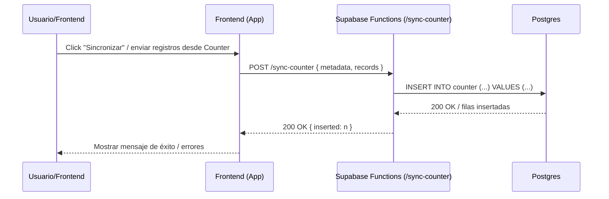
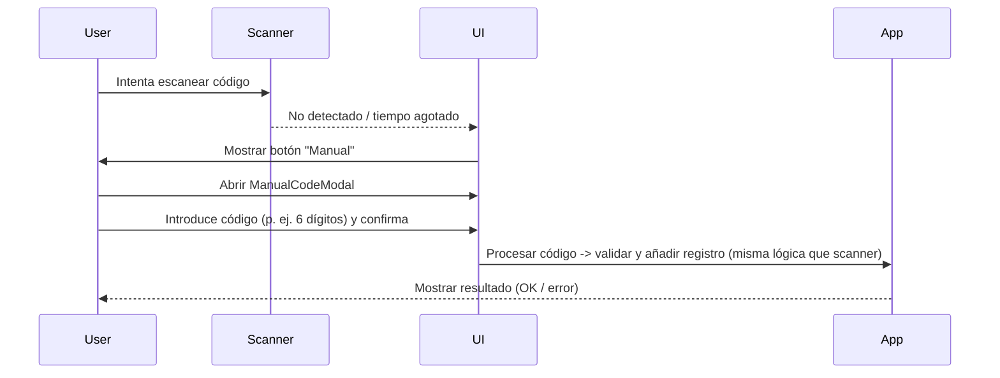
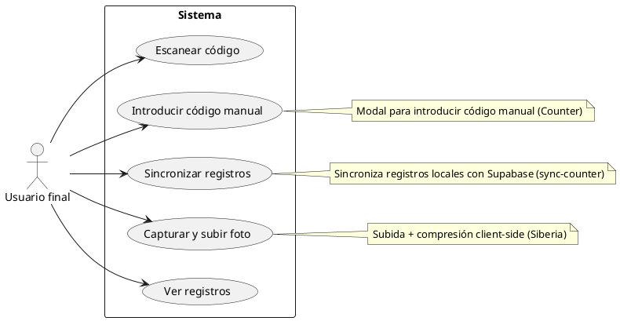
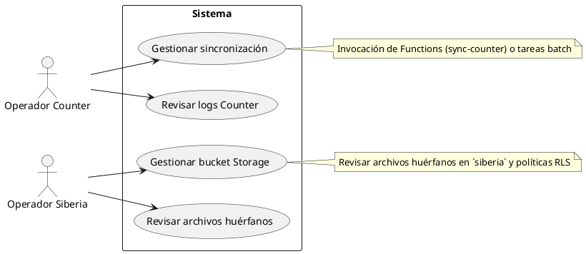

# Diagramas — Flujos y Casos de Uso (Usuarios finales)

Este documento contiene diagramas de flujo y diagramas de casos de uso orientados a usuarios finales. Los diagramas están en sintaxis Mermaid (para flujos y secuencias) y PlantUML (para diagramas de casos de uso). Puedes renderizarlos con herramientas compatibles (VS Code plugins, PlantUML server, Mermaid live editor, etc.).


## Índice

- Flujos principales (Mermaid)
  - Flujo: Captura y subida de foto (Siberia)
  - Flujo: Sincronización de registros (Counter / sync-counter)
  - Secuencia: Manual entry fallback (Counter)
- Casos de uso (PlantUML)
  - Diagrama: Casos de uso - Usuario final (Counter + Siberia)
  - Diagrama: Casos de uso - Operador (sync, storage)


---

## Flujos principales (Mermaid)

### 1) Flujo: Captura y subida de foto (Siberia)

```mermaid
flowchart TD
  U[Usuario abre página Siberia] --> Select[Selecciona o toma foto]
  Select --> Compress[compressImage (cliente)]
  Compress --> Upload[Upload a Storage (bucket siberia)]
  Upload --> GetUrl[Obtener public/signed URL]
  GetUrl --> Insert[Insertar registro en tabla `siberia` vía Function/DB]
  Insert --> Decision{Insert OK?}
  Decision -->|Sí| Success[Mostrar "Registro creado" en UI]
  Decision -->|No| Cleanup[Eliminar objeto de Storage]
  Cleanup --> Error[Mostrar error en UI]

  classDef userAction fill:#e2f7ff,stroke:#0366d6;
  class Select,Upload,Insert userAction;
```

Descripción rápida: el cliente comprime la imagen, sube al bucket `siberia`, obtiene la URL y envía los metadatos al backend para persistir; si la inserción falla se elimina el archivo.


### 2) Flujo: Sincronización de registros (Counter / sync-counter)



Notas: en el frontend se recomienda enviar un token de sesión en `Authorization` y evitar exponer `service_role` en el cliente.


### 3) Secuencia: Fallback Manual (Counter - entrada manual de código)



Este flujo asegura que el usuario tiene alternativa cuando el escaneo falla (botón Manual dentro de la vista ScannerView).


---

## Casos de uso (PlantUML)

> Nota: para renderizar PlantUML usa un plugin de PlantUML en tu editor o un servidor PlantUML.

### 1) Casos de uso — Usuario final (Counter + Siberia)




### 2) Casos de uso — Operadores: Counter y Siberia




---

## Cómo integrar estos diagramas en la documentación

- Para Mermaid: muchos renderizadores MkDocs/Docsify/VuePress soportan Mermaid nativamente; también puedes usar el plugin `markdown-it-mermaid`.
- Para PlantUML: usa PlantUML server o plugins (VSCode PlantUML) y embece las imágenes resultantes (PNG/SVG) en la documentación final.


---

Si quieres, puedo también generar archivos SVG/PNG de los diagramas (renderizados) o agregar estos diagramas dentro del README o Wiki del proyecto. ¿Deseas que los exporte como imágenes y los añada al repo? 
